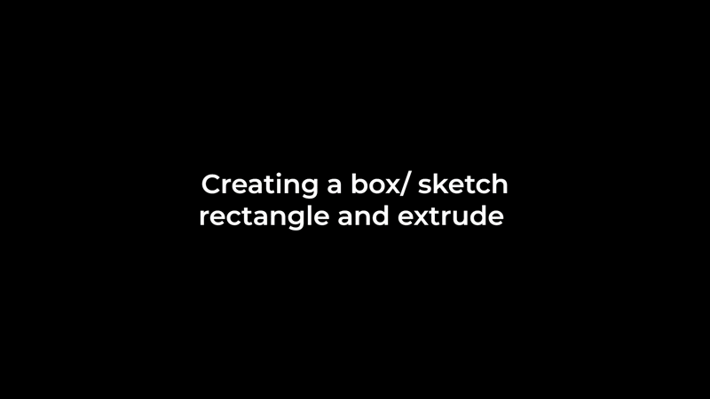

# Fusion 360 Agentic CAD and MCP Server

Fusion MCP Integration connects AI assistants to Autodesk Fusion 360 via the Model Context Protocol (MCP), enabling:

-✨ Conversational CAD — create and edit 3D models using natural language
-🤖 AI-driven automation — automate repetitive modeling steps and workflows
-🔧 Parametric control — update dimensions, features, and patterns through parameters
-🎓 More accessible CAD — reduce the learning curve for non-CAD users

A lightweight **agentic / programmatic CAD** workflow for **Autodesk Fusion 360**:
- A **Fusion Add-in** exposes a small HTTP “bridge” (tool server) inside Fusion.
- A **Python CLI client** talks to that bridge and routes LLM tool calls to Fusion.
- You can create parametric parts (flanges, holes, patterns) and extend the toolset over time.

> ✅ Runs locally on Windows.  
> ⚠️ This repo does **not** ship Autodesk Fusion 360 itself. You must have Fusion installed and running.

---

## Table of Contents
- [Architecture](#architecture)
- [Repository Layout](#repository-layout)
- [Prerequisites](#prerequisites)
- [Quick Start](#quick-start)
- [Install the Fusion Add-in](#install-the-fusion-add-in)
- [Configure Environment Variables](#configure-environment-variables)
- [Run the Client](#run-the-client)
- [Example Prompts](#example-prompts)
- [Fusion Bridge API](#fusion-bridge-api)
- [Adding New Tools](#adding-new-tools)
- [Troubleshooting](#troubleshooting)
- [Security Notes](#security-notes)
- [Roadmap](#roadmap)
- [License](#license)

---

## Architecture

**You type** a CAD request → **Python client** calls an LLM → LLM returns structured JSON tool calls → **client** sends tool requests to the local **FusionBridge** → **Fusion add-in** executes the operations inside Fusion.

```
User Prompt
   │
   ▼
client/chat_cli.py  ──(LLM tool JSON)──▶  FusionBridge HTTP (inside Fusion)
   │                                      │
   └──────────────(tool_result JSON)◀─────┘
```

---

## Repository Layout

Typical structure:

```
FusionAgenticCAD/
  client/                 # Python CLI client (LLM + tool router)
  fusion_addin/            # Fusion 360 add-in: HTTP bridge + tools
  mcp_server/              # Future integrations 
  Recordings-Example/      # demo recordings, screenshots, examples
  .env.example             # environment template
  README.md
  LICENSE
```

---

## Prerequisites

### Required
- **Autodesk Fusion 360** installed and running
- **Python 3.10+**
- A terminal (PowerShell recommended on Windows)
- An OpenAI API key (or whichever model provider you configure)

### Python packages
- `httpx`
- `python-dotenv`
- `openai`

(Recommended: include `client/requirements.txt` in your repo.)

---

## Quick Start

### 1) Clone the repository

```bash
git clone https://github.com/<your-username>/FusionAgenticCAD.git
cd FusionAgenticCAD
```

### 2) Create a Python virtual environment

**Windows (PowerShell):**
```powershell
python -m venv .venv
.\.venv\Scripts\Activate.ps1
```

### 3) Install Python dependencies

```powershell
pip install -r client\requirements.txt
```

### 4) Copy `.env.example` → `.env`

```powershell
copy .env.example .env
```

Then edit `.env` with your values (see below).

### 5) Install and run the Fusion Add-in

Follow the steps in [Install the Fusion Add-in](#install-the-fusion-add-in).

### 6) Start the client

```powershell
python client\chat_cli.py
```

---

## Install the Fusion Add-in

Fusion add-ins are loaded from Fusion’s AddIns directory.

### Option A (recommended): Use Fusion’s Add-ins dialog
1. Open **Fusion 360**
2. Go to **Utilities → Add-ins**
3. Click the **+** (Add) or go to the **Add-ins** tab
4. Select the folder inside this repo:
   - `fusion_addin/` (or the specific add-in folder inside it)
5. Click **Run**
6. Optionally enable **Run on Startup**

✅ When the bridge starts successfully, you should see a message like:
> “FusionBridge HTTP running at http://127.0.0.1:18080”

### Option B: Copy into Fusion AddIns folder (manual)
Copy the add-in folder into Fusion’s addins directory (varies by install/user).

Common location on Windows:
- `%APPDATA%\Autodesk\Autodesk Fusion 360\API\AddIns`

Then load it from **Utilities → Add-ins**.

---

## Configure Environment Variables

Create `.env` from `.env.example` and fill:

```env
OPENAI_API_KEY=your_api_key_here
FUSION_BRIDGE_URL=http://127.0.0.1:18080
FUSION_BRIDGE_TOKEN=your_shared_token_here
```

### Important
- `FUSION_BRIDGE_TOKEN` **must match** the token inside the Fusion add-in server script (`AUTH_TOKEN`).
- Never commit `.env` to GitHub (add it to `.gitignore`).

---

## Run the Client

From the repo root:

```powershell
python client\chat_cli.py
```

You should see:
- a CLI banner
- example prompts
- and then a `You:` prompt

---

## Example Prompts

Try these once Fusion is open and the add-in is running.

---

### 1) Box (parametric solid)
**Prompt**
- `Create a box: length 80 mm, width 50 mm, height 30 mm. Add 4 corner fillets (R=3 mm).` [ you can specify the sketch plane]

**Preview**
[](Recordings-Example/Box.mp4)

---

### 2) Cylinder (basic revolve / extrude)
**Prompt**
- `Create a cylinder: diameter 40 mm, height 60 mm. `
- Create a circle with radius 40 mm , and extrude 10 mm height. [ you can specify the sketch plane]

**Preview**
[](Recordings-Example/Cylinder.mp4)

---

### 3) Flange with bolt pattern + countersinks
**Prompt**
- `Create a flange: disc OD 120 mm, thickness 12 mm; hub OD 70 mm, hub height 20 mm; bore 35 mm.` [ you can specify the sketch plane]
- `Add 6 bolt holes: BCD 90 mm, hole dia 8 mm.`

**Preview**
[](Recordings-Example/Flangewithholes.mp4)

---

### 4) Cleanup (reset workspace)
**Prompt**
- `Delete everything and reset the design to an empty state.`

---

## Fusion Bridge API

The Fusion add-in exposes tools over:

- `GET /ping`
- `GET /state`
- `POST /tool` with JSON:
  ```json
  { "tool": "<tool_name>", "args": { ... } }
  ```

### Tool naming
The client tool router must match the add-in `_TOOL_MAP` keys exactly.

---

## Adding New Tools

When you add a new Fusion tool:

1. **Fusion side (add-in)**
   - Implement a function: `def _my_tool(payload): ...`
   - Register it in `_TOOL_MAP`:
     ```python
     _TOOL_MAP["my_tool"] = _my_tool
     ```

2. **Client side (Python CLI)**
   - Add an entry to `TOOL_ROUTER`:
     ```python
     "fusion_my_tool": ("POST", "my_tool")
     ```
   - Add/describe the tool schema in the `SYSTEM` prompt so the model uses correct args.

3. Restart Fusion add-in + restart the client.

---


## Roadmap

Potential improvements:
- More robust face/body selection helpers (pick by role)
- Parametric templates for shafts, housings, gears
- Automatic retry strategies for sketch/profile creation
- Unit tests + golden geometry examples

---

## License

MIT License -Copyright (c) 2026 Avez Shaikh
See `LICENSE`.
